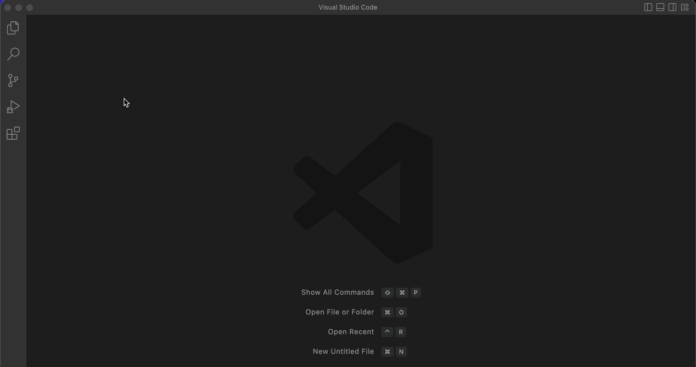
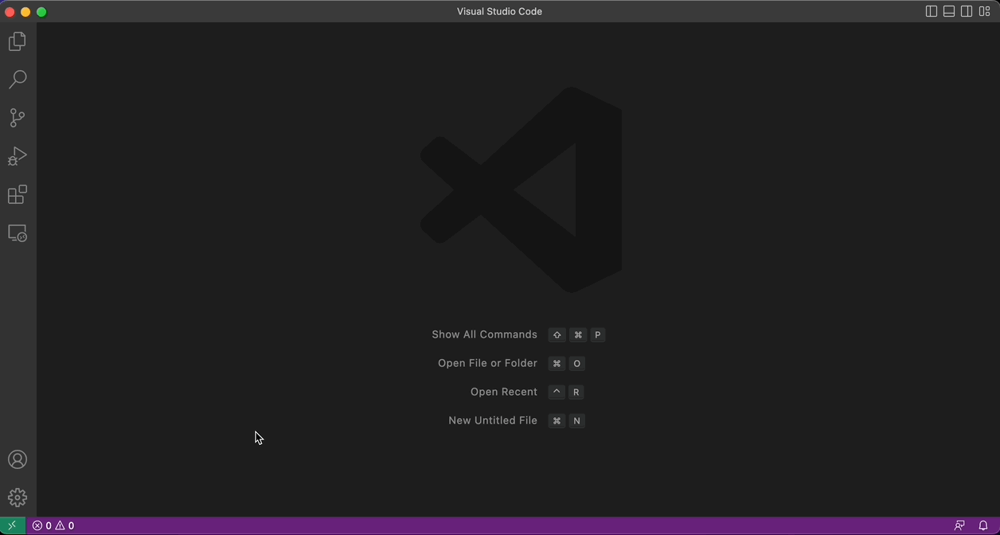
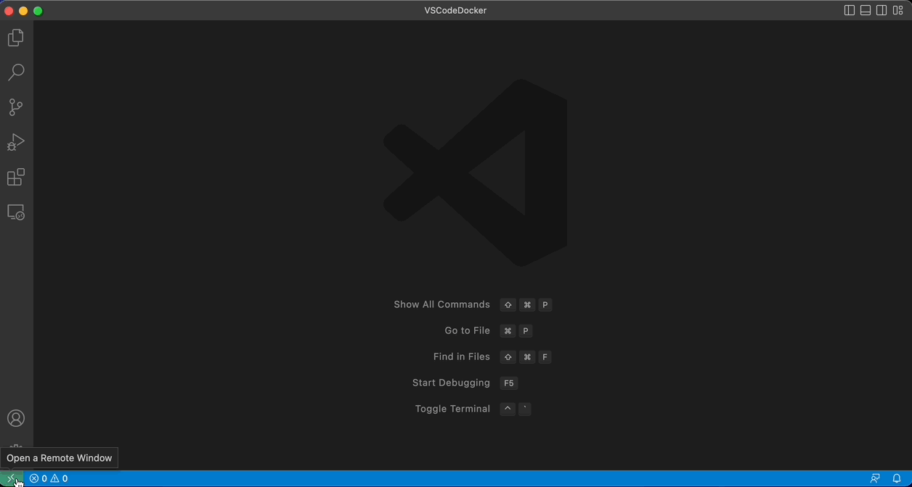
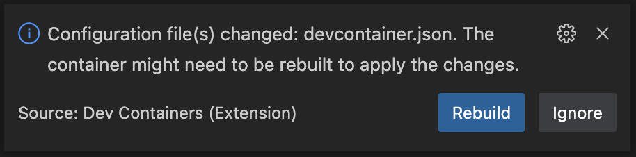
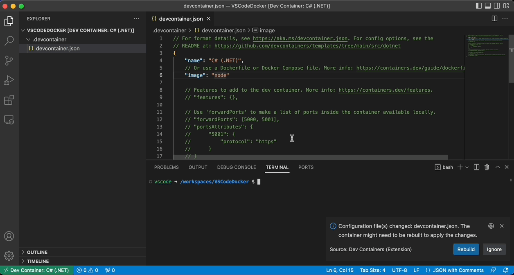
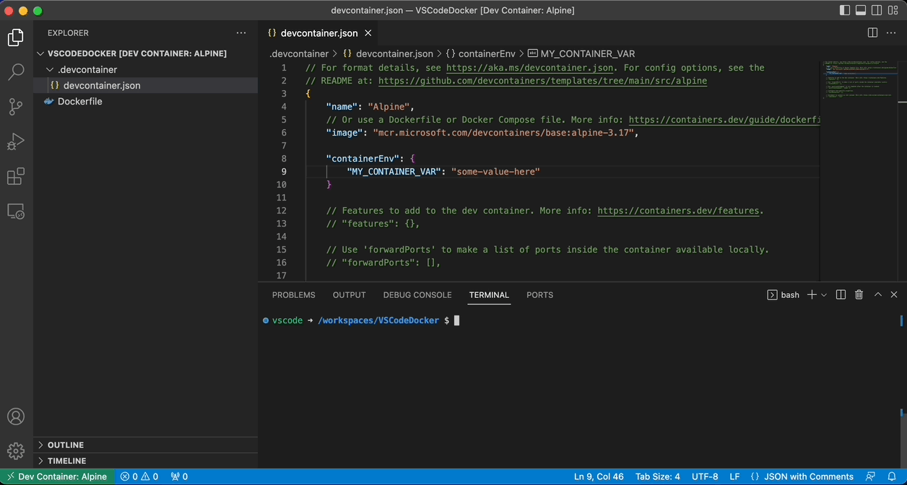
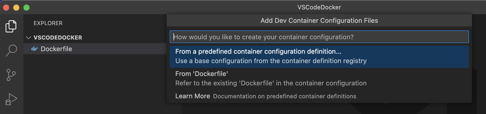

O Visual Studio Code é um editor de código popular entre os desenvolvedores. Uma de suas funcionalidades mais poderosas é a capacidade de utilizar contêineres para configurar um ambiente de desenvolvimento consistente e isolado. O plugin de DevContainer é uma solução para facilitar essa configuração.

Neste artigo, falarei as vantagens do uso do plugin de DevContainer do VS Code e explicarei como configurá-lo.

# **Vantagens do uso do plugin de DevContainer**

Antes de detalhar a instalação e forma de uso, vamos destacar as vantagens do uso do plugin de DevContainer:

* **Ambientes de desenvolvimento consistentes e isolados**
    

Com o DevContainer, você pode garantir que todos os desenvolvedores trabalhem com o mesmo ambiente de desenvolvimento, utilizando as mesmas ferramentas e bibliotecas. Isso evita problemas de compatibilidade e garante que o desenvolvimento ocorra de forma consistente. Além disso, é possível manter uma padronização nas configurações, mesmo em diferentes máquinas.

* **Fácil Configuração**
    

A configuração de um ambiente de desenvolvimento pode ser uma tarefa complicada e demorada. Com o DevContainer, a configuração é feita automaticamente, economizando tempo e esforço.

* **Ambientes de desenvolvimento escaláveis**
    

O DevContainer permite escalar o ambiente de desenvolvimento para atender às necessidades do projeto. É possível adicionar novas ferramentas e bibliotecas ao contêiner conforme necessário, sem precisar configurar cada máquina de desenvolvimento individualmente.

* **Testes de integração mais fáceis**
    

O DevContainer torna mais fácil testar a integração do aplicativo em diferentes ambientes. É possível criar contêineres para cada ambiente de produção e teste e garantir que o aplicativo funcione corretamente em cada ambiente.

# **Configuração do plugin de DevContainer**

Agora que destacamos as vantagens do uso do plugin de DevContainer, vamos explicar como configurá-lo:

* **Instale o Docker em sua máquina.**
    

Antes de configurar o DevContainer, você precisa ter o Docker instalado em sua máquina. Você pode baixar e instalar o Docker a partir do site oficial ([https://www.docker.com/products/docker-desktop](https://www.docker.com/products/docker-desktop)).

* **Abra o VS Code e crie um novo arquivo ou pasta para o seu projeto.**
    
* **Instale o plugin Dev Container**
    

Na aba de extensões, procure por Dev Container e siga as instruções de instalação.



* **Na barra lateral, clique no ícone "Remote Explorer" ou pressione Ctrl + Shift + P para abrir a barra de comando e digite "Remote-Containers: Open Folder in Container".**
    



* **Selecione a pasta do seu projeto**
    
* **Escolha a imagem a ser utilizada**
    

Um menu para a escolha de qual imagem deve ser usada será exibido. A lista de templates disponíveis pode ser encontrada [aqui](https://containers.dev/templates).

Isso pode levar alguns minutos, dependendo do tamanho do seu projeto.

* **Depois que o DevContainer estiver configurado, o VS Code abrirá automaticamente uma nova janela com o ambiente de desenvolvimento dentro do contêiner.**
    

É possível escolher diversas aplicações que auxiliam no processo de desenvolvimento para serem instaladas durante o build da imagem, por exemplo, AWS CLI, Google Cloud CLI, etc. Uma lista das features disponíveis pode ser encontrada [aqui](https://containers.dev/features).

> Importante comentar que o GIT já vai instalado em todas as imagens padrão disponibilizadas. Sendo assim, a imagem mais simples, que é a Alpine, já vem com o GIT não sendo necessária a sua instalação.



## .devcontainer

Ao se conectar a um container pela primeira vez, uma pasta é criada, a `.devcontainer`. Dentro desta pasta encontramos um arquivo chamado `devcontainer.json`. É neste arquivo que as principais configurações são guardadas.

O conteúdo do arquivo é semelhante ao seguinte código:

```json
{
	"name": "C# (.NET)",
	// Or use a Dockerfile or Docker Compose file. More info: https://containers.dev/guide/dockerfile
	"image": "mcr.microsoft.com/devcontainers/dotnet:0-7.0"

	// Features to add to the dev container. More info: https://containers.dev/features.
	// "features": {},

	// Use 'forwardPorts' to make a list of ports inside the container available locally.
	// "forwardPorts": [5000, 5001],
	// "portsAttributes": {
	//		"5001": {
	//			"protocol": "https"
	//		}
	// }

	// Use 'postCreateCommand' to run commands after the container is created.
	// "postCreateCommand": "dotnet restore",

	// Configure tool-specific properties.
	// "customizations": {},

	// Uncomment to connect as root instead. More info: https://aka.ms/dev-containers-non-root.
	// "remoteUser": "root"
}
```

## Image

Na chave `image` é onde se localiza o nome e a versão da imagem que será usada para criar o container. É possível, troca-la por uma outra totalmente diferente caso seja necessário. Trocando o nome da imagem, ao reabrir a pasta usando o container, será exibida uma janela perguntando se a imagem precisa ser reconstruída.



Essa janela aparecerá sempre que ocorrer qualquer alteração na imagem, ou em alguma configuração do container. Para que as alterações sejam realizadas, o container precisa ser reconstruído. Depois de reconstruído, os arquivos da pasta aberta no VSCode continuarão disponíveis.



Mais informações sobre como formatar o arquivo podem ser encontradas [aqui](https://aka.ms/devcontainer.json).

## Variáveis de ambiente

É possível definir variáveis de ambiente no arquivo .devcontainer. Para isso basta usar a chave `containerEnv`.



Mais detalhes e outras formas de setar variáveis de ambiente podem ser encontradas neste [link](https://code.visualstudio.com/remote/advancedcontainers/environment-variables).

## Usando um Dockerfile

Ao iniciar um container em uma pasta que contenha um Dockerfile o VSCode irá exibir as seguintes opções:



Ao selecionar a opção "From a predefined container...", as imagens pré-definidas serão exibidas e o fluxo seguirá como explicado anteriormente.

Selecionando a opção de usar o Dockerfile, o container será construído de acordo com o arquivo e a pasta será montada dentro do container. Neste caso, qualquer imagem, tanto do registry público do docker quanto de algum registry privado que você tenha acesso, poderá ser utilizada.

# Conclusão

O plugin DevContainer do VS Code é uma ferramenta poderosa que ajuda a garantir ambientes de desenvolvimento consistentes e isolados. Ao aproveitar as vantagens do DevContainer, é possível acelerar o processo de desenvolvimento, garantir a compatibilidade e facilitar a configuração e os testes de integração. Espero que este artigo tenha sido útil e que você possa aproveitar ao máximo o DevContainer em seu próximo projeto.

Descobriu algo novo, ou usa o plugin de uma forma diferente? Conhece algo que possa funcionar melhor do que o que foi apresentado aqui? Deixa um comentário para discutirmos todas as ideias.
