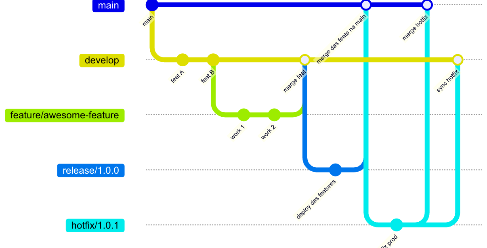
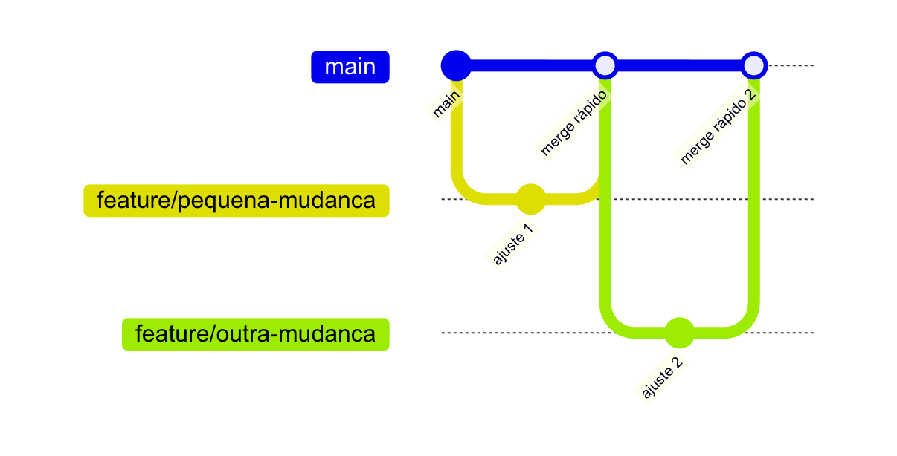

Quando começamos um sistema, o controle de versão raramente é o centro das preocupações. Criamos algumas branches, fazemos merges quando necessário, lidamos com conflitos de vez em quando e seguimos adiante. Enquanto o time é pequeno e o produto ainda está ganhando forma, essa abordagem funciona surpreendentemente bem.

Com o tempo, a situação muda. A base de código cresce, mais pessoas entram no repositório, o produto passa a ter dependências externas, integrações, requisitos não-funcionais mais rígidos. Aquele fluxo “meio improvisado” começa a mostrar rachaduras. O que antes era apenas um incômodo vira um obstáculo: pull requests enormes que ninguém quer revisar, features que “estão prontas” mas não chegam à produção, dificuldade em descobrir quando um bug foi introduzido, histórico de commits praticamente inútil para entender o que aconteceu.

É tentador culpar o Git, como se o problema estivesse na ferramenta. Mas, na maioria das vezes, o que está em jogo é o desenho do fluxo de trabalho por cima dela: como branches são criadas, como são integradas, como o time estrutura releases e como registra a história das mudanças.

Neste texto, vou tratar desse fluxo a partir de três elementos: o papel de estratégias de branching como GitFlow e trunk-based development, as diferenças de mentalidade entre essas abordagens e a forma como convenções de commit, em especial os Conventional Commits, ajudam a transformar o histórico em um recurso útil. A intenção não é defender um modelo “correto”, mas oferecer um vocabulário e alguns critérios para você olhar para o seu contexto e decidir conscientemente como quer trabalhar.

---

## **Ajustando o vocabulário**

Antes de comparar estilos, é útil garantir que estamos usando as mesmas palavras para as mesmas coisas.

**Uma branch** é, essencialmente, uma linha alternativa de desenvolvimento. Em vez de todos trabalharem diretamente sobre a mesma linha do tempo, criamos “ramificações” para isolar mudanças. Isso permite explorar uma funcionalidade, refatorar um módulo ou testar uma abordagem sem interferir imediatamente na linha principal.

Quase sempre existe uma branch que tratamos como “tronco”: `main`, `master` ou `trunk`. A intenção é que essa branch represente um estado do código que, em teoria, poderia ir para produção. Não significa que todo commit deva ser implantado imediatamente, mas que a branch principal não deveria estar sistematicamente quebrada.

Integração contínua entra justamente nesse ponto. Ao integrar mudanças com frequência na branch principal e validar automaticamente o resultado, reduzimos o intervalo entre introduzir uma alteração e descobrir que ela causou um problema. Quanto menor esse intervalo, menor a área de busca quando algo dá errado.

Um segundo conceito importante é o de **janelas de release**. Alguns produtos podem ir para produção várias vezes ao dia; outros só podem ser atualizados em momentos específicos, ou precisam passar por etapas de homologação formais. O modelo de branching precisa respeitar essa realidade: é difícil falar seriamente em trunk-based development se o produto só pode ser atualizado uma vez por trimestre.

Por fim, há as **feature flags**. A ideia é simples: separar a presença do código da ativação do comportamento. O código de uma nova funcionalidade pode ser integrado gradualmente, mas o comportamento só é exposto quando uma flag é ligada. Em termos de código, algo como:

```ts
if (isFeatureEnabled("nova-tela-cadastro")) {
  // comportamento novo
} else {
  // comportamento antigo
}
```

Esse recurso é particularmente útil em estratégias que privilegiam integração frequente, porque permite levar código incompleto para a branch principal sem expô-lo para todos os usuários.

Com esses conceitos em mente, podemos olhar para GitFlow e trunk-based sem confundir os papéis que cada um desempenha.

---

## **GitFlow: releases como eixo de organização**

GitFlow surgiu como uma proposta de dar mais estrutura ao uso de branches em equipes que precisavam lidar com releases bem definidas. Ele parte da ideia de que desenvolvimento contínuo e estabilização de uma release são atividades diferentes e, portanto, merecem linhas distintas na história do repositório.

Numa configuração típica, temos uma branch principal (`main`) representando o que está, ou pode estar, em produção; uma branch de desenvolvimento (`develop`), que acumula as mudanças da próxima versão; branches de funcionalidade (`feature/...`), que nascem de `develop`; branches de release (`release/...`), que surgem quando o time decide empacotar um conjunto de mudanças; e branches de hotfix (`hotfix/...`), usadas para corrigir problemas em produção.

É possível visualizar essa estrutura como um fluxo em camadas:



No dia a dia, o fluxo costuma se parecer com isto. Você começa uma nova funcionalidade criando `feature/cadastro-cliente-pj` a partir de `develop`. Trabalha nessa branch até que a funcionalidade faça sentido de ponta a ponta; em seguida, abre um pull request de `feature/cadastro-cliente-pj` para `develop`. Depois da revisão e dos testes, essa mudança passa a compor a próxima versão.

Com o passar do tempo, `develop` acumula diversas funcionalidades. Em algum momento o time decide que o conjunto atual está “suficiente” para ser lançado. Nesse ponto, cria-se algo como `release/1.3.0` a partir de `develop`. Essa branch de release congela o conjunto de mudanças e muda o foco: de novos recursos para correções, ajustes finos e estabilização. Quando a release está estável, ela é mergeada em `main` e marcada com uma tag (por exemplo `v1.3.0`). Em seguida, a mesma release é mergeada de volta em `develop`, para que correções feitas durante a estabilização não se percam.

Problemas críticos em produção costumam seguir um caminho paralelo. Em vez de esperar pela próxima release planejada, o time cria, a partir de `main`, uma branch de hotfix, por exemplo `hotfix/1.3.1`, faz a correção, mergeia de volta em `main` com uma nova tag e traz essa correção para `develop`.

Quando esse fluxo funciona bem, ele oferece uma estrutura clara. É possível responder com precisão à pergunta “o que entrou na versão 1.3.0?”, localizar correções feitas em hotfix e manter uma separação razoável entre código em desenvolvimento e código em estabilização.

Não é por acaso que GitFlow ganhou adoção em contextos com forte preocupação com controle de versão: sistemas regulados, produtos que passam por homologações demoradas, equipes que precisam sincronizar lançamentos com outras áreas da empresa. Quando se fala em “versões” de forma explícita para o negócio, GitFlow fornece um vocabulário natural.

O problema aparece quando ampliamos a estrutura, mas não a disciplina. Nada no modelo impede branches de feature de viverem semanas, pull requests de crescerem até se tornarem praticamente irrecensáveis ou releases de ficarem indefinidamente em modo de estabilização. Em muitos times, GitFlow acaba reforçando o acúmulo: código “pronto” que demora para ser lançado, correções que precisam ser aplicadas em múltiplas branches, divergências constantes entre `main` e `develop`.

Quando isso acontece, a estrutura passa a trabalhar contra o fluxo. Manter o modelo começa a exigir esforço mental considerável: é preciso lembrar em qual branch uma correção deve entrar primeiro, qual conjunto de mudanças está sendo estabilizado e como reconciliar branches que se distanciaram demais. O próprio modelo, que deveria trazer clareza, se torna fonte de confusão.

Por isso, ao adotar algo inspirado em GitFlow, vale a pena pensar numa versão mais contida. Branches de feature precisam ter vida curta; branches de release não podem se transformar em projetos paralelos; hotfix deve ser exceção, não regra. O modelo continua o mesmo, mas a forma de usá-lo muda de maneira significativa.

---

## **Trunk-based development: mudanças pequenas, integração frequente**

Trunk-based development parte de uma observação simples: quanto mais tempo uma branch vive afastada do tronco, mais cara será a integração quando ela finalmente voltar. A estratégia, então, é reduzir ao mínimo essa distância. Em vez de longos períodos em branches paralelas, o foco passa a ser integrar mudanças pequenas com frequência na branch principal.

Na maioria dos casos, essa branch principal é `main`. O desenvolvimento ainda faz uso de branches de trabalho, mas elas são efêmeras: nascem, carregam uma mudança pequena, passam por revisão, são integradas e morrem. O resultado é um fluxo bem mais próximo do tronco do que no GitFlow tradicional.

Um diagrama simplificado ajuda a visualizar:



Voltando ao exemplo da validação de CPF, num fluxo trunk-based você provavelmente começaria atualizando `main`, criaria uma branch como `pedro/ajuste-validacao-cpf`, faria a alteração, escreveria ou ajustaria os testes e abriria um pull request pequeno para `main`. Depois da revisão e da pipeline, a branch seria integrada e descartada. Se a alteração faz parte de uma funcionalidade maior que ainda não pode aparecer para todos, a ativação fica a cargo de uma feature flag, não de uma branch de longa duração.

Esse modelo exige que algumas condições estejam presentes. A primeira é uma pipeline de integração confiável: não faz sentido encorajar integração frequente em uma branch central se o time não tem como saber rapidamente quando algo quebrou. A segunda é uma disciplina em relação ao tamanho das mudanças. Trunk-based com pull requests grandes não é trunk-based; é apenas um GitFlow com menos branches de nome diferente. A terceira é uma certa maturidade em testes automatizados: quanto menos cobertura, mais difícil manter a confiança em uma branch principal em constante movimento.

Quando essas condições existem, os benefícios são claros. Conflitos de merge tendem a ser menores, porque as branches não se afastam tanto. Revisões tornam-se mais manejáveis, porque os pull requests têm escopo limitado. O tempo entre um desenvolvedor começar uma mudança e essa mudança estar efetivamente presente na branch principal diminui de forma considerável. Em ambientes onde a implantação também é frequente, esse tempo se aproxima bastante do tempo até produção.

Trunk-based costuma combinar bem com arquiteturas distribuídas e microsserviços. Cada serviço pode evoluir em passos pequenos, com deploys independentes. Em vez de coordenar grandes releases contendo dezenas de alterações, a equipe se acostuma com um fluxo contínuo de mudanças menores.

Isso não significa que trunk-based seja apropriado para qualquer contexto. Em ambientes com janelas de release rígidas e processos de aprovação longos, a integração frequente precisa conviver com uma etapa posterior de aprovação, e essa transição não é trivial. Ainda assim, mesmo nesses casos, é possível se beneficiar de uma mentalidade de mudanças pequenas dentro dos limites impostos pelas regras externas.

---

## **Mudança de mentalidade**

É tentador tratar GitFlow e trunk-based como escolhas puramente técnicas. Na prática, a principal diferença entre eles é de mentalidade.

Quando uma equipe adota algo próximo de GitFlow, a conversa tende a orbitar em torno das branches e das versões. Com frequência ouvimos perguntas como: “em que branch essa correção deve entrar?”, “quando abrimos a branch da versão 1.4?”, “essa mudança ainda cabe na release atual?”. A atividade de desenvolvimento é organizada em torno de “pacotes” que recebem um rótulo de versão.

Num ambiente trunk-based, as perguntas mudam de foco. O que passa a ocupar espaço é: “como podemos quebrar essa mudança em incrementos menores?”, “isso cabe em um pull request que alguém consiga revisar em poucos minutos?”, “como levamos essa alteração para produção sem depender de uma grande janela de release?”. O eixo de organização deixa de ser a versão e passa a ser o tamanho e a cadência das mudanças.

Uma forma útil de comparar esses dois modos de pensar é observar dois intervalos de tempo. O primeiro é o que vai de “alguém começa a trabalhar numa mudança” até “essa mudança está presente na branch principal”. O segundo é o que vai de “a mudança está na branch principal” até “a mudança está em produção”. Equipes que trabalham em trunk-based saudável tendem a manter esses dois intervalos relativamente curtos e previsíveis. Equipes presas em estratégias mal ajustadas frequentemente convivem com intervalos longos, cheios de exceções.

Quando esses intervalos ficam grandes demais, não importa tanto o modelo nominal: o time passa a depender de esforço heroico a cada release, e o controle de versão deixa de ser um aliado para se tornar uma fonte de ansiedade.

---

## **O “Híbrido" do mundo real**

Embora seja comum apresentar GitFlow e trunk-based como extremos, a maioria das equipes acaba adotando variações intermediárias. Isso é saudável; modelos não existem para serem seguidos literalmente, mas para fornecerem ideias que possamos adaptar.

Um time que valoriza os benefícios de trunk-based pode, por exemplo, manter uma branch principal bem viva, com pull requests pequenos e uso intensivo de feature flags, mas introduzir branches de release em momentos específicos do ano, quando o risco de uma falha é particularmente caro. Durante esses períodos, as mudanças que podem ir para produção passam pela branch de release, enquanto o desenvolvimento de médio prazo continua nas branches de trabalho que convergem para `main`.

Da mesma forma, uma equipe que declara usar GitFlow pode gradualmente simplificar o modelo: manter `main` e `develop`, limitar fortemente a duração das branches de feature, reduzir o uso de branches de release e delegar mais responsabilidade à automação de versionamento e marcação de tags. O resultado prático se aproxima bastante de trunk-based, ainda que a nomenclatura continue a ecoar o modelo original.

Ao pensar nessas misturas, vale observar um ponto: quanto mais responsabilidade colocamos na estrutura de branches, menos somos obrigados a fragmentar as mudanças. Quanto mais decisão deslocamos para o tamanho e a forma das alterações, menos dependemos de uma estrutura sofisticada de branches. É uma escolha de trade-off organizacional, não apenas técnica.

---

## **Conventional Commits: dando forma ao histórico**

Até aqui falei de como o código se movimenta entre branches. Mas o histórico que fica registrado é igualmente relevante. Um fluxo de branches bem desenhado perde muito valor se as mensagens de commit forem opacas.

É comum ver repositórios cheios de commits com mensagens como “ajustes”, “teste”, “mudanças finais”, “corrigindo bug”. Quando precisamos entender o que realmente aconteceu numa determinada área do sistema, esse tipo de histórico dificulta o trabalho. Por outro lado, quando cada commit carrega um mínimo de estrutura e contexto, o log passa a ser uma ferramenta útil tanto para humanos quanto para automações.

Conventional Commits são uma proposta de convenção leve para trazer essa estrutura. A ideia é adotar um formato simples para as mensagens, expressando o tipo de mudança, o escopo e, quando necessário, detalhes adicionais.

A forma geral é:

```text
<tipo>[escopo opcional]: <descrição curta>

[corpo opcional]

[rodapé opcional]
```

O tipo indica a natureza da alteração. Em muitos projetos, um pequeno conjunto de tipos já é suficiente para começar: `feat` para uma nova funcionalidade, `fix` para correções de bugs, `docs` para mudanças de documentação, `refactor` para alterações internas sem mudança de comportamento, `test` para adição ou ajuste de testes, `chore` para tarefas auxiliares como scripts e configurações.

O escopo, quando usado, ajuda a localizar mentalmente o efeito da mudança: algo como `auth`, `payment`, `checkout`, `api` e assim por diante.

Na prática, isso se traduz em mensagens como:

```text
feat(auth): adiciona login com Google
```

Ou, numa correção um pouco mais detalhada:

```text
fix(payment): corrige cálculo de juros no parcelamento

O problema acontecia quando o número de parcelas era maior que 12.
Atualizamos a fórmula e adicionamos testes cobrindo este cenário.
```

Quando uma mudança quebra compatibilidade, isso pode ser explicitado:

```text
feat(api): remove endpoint de autenticação legado

BREAKING CHANGE: o endpoint /v1/login foi removido. Clientes devem migrar para /v2/login.
```

Com o tempo, um histórico construído dessa forma é muito mais fácil de interpretar. Também cria uma base para automação. Se o projeto adota versionamento semântico (por exemplo, versões do tipo `MAJOR.MINOR.PATCH`), ferramentas podem analisar o histórico, identificar commits que introduzem `BREAKING CHANGE`, somar novas funcionalidades (`feat`) e correções (`fix`) e sugerir novas versões e changelogs.

Essa disciplina é útil tanto num fluxo inspirado em GitFlow quanto num trunk-based. Em estratégias centradas em release, ela ajuda a responder “o que exatamente entrou na versão 1.3.0?”. Em estratégias centradas em integração frequente, ajuda a não perder o contexto no meio de muitos commits pequenos.

---

## **Considerações finais**

**GitFlow** oferece uma estrutura clara para contextos em que releases são unidades importantes de planejamento e comunicação. Ele funciona bem quando é usado para dar visibilidade e controle, e não como justificativa para atrasos permanentes.

**Trunk-based development** enfatiza mudanças pequenas e integração frequente. Ele funciona melhor onde há investimento em automação e testes, e onde o produto se beneficia de uma cadência mais contínua de entrega.

**Conventional Commits**, por sua vez, tratam do aspecto mais frequentemente negligenciado: a legibilidade do histórico. Independentemente do modelo de branching, o hábito de escrever commits que expliquem o que mudou, onde mudou e por quê transforma o controle de versão em uma ferramenta de entendimento, não apenas de armazenamento.

Em última análise, a pergunta relevante não é “qual modelo é melhor em abstrato?”, mas “que fluxo de versionamento ajuda este time, com este produto e estas restrições, a entregar com segurança e previsibilidade?”. A resposta raramente é uma receita pronta. Ela emerge da combinação de alguns princípios simples: reduzir o tamanho das mudanças, integrar com frequência quando isso é possível, tornar o histórico legível e ajustar a estrutura de branches ao contexto real, em vez de ao diagrama de referência.

O Git, por si só, é apenas uma ferramenta. O valor está na forma como escolhemos contar a história do sistema em cima dela.
